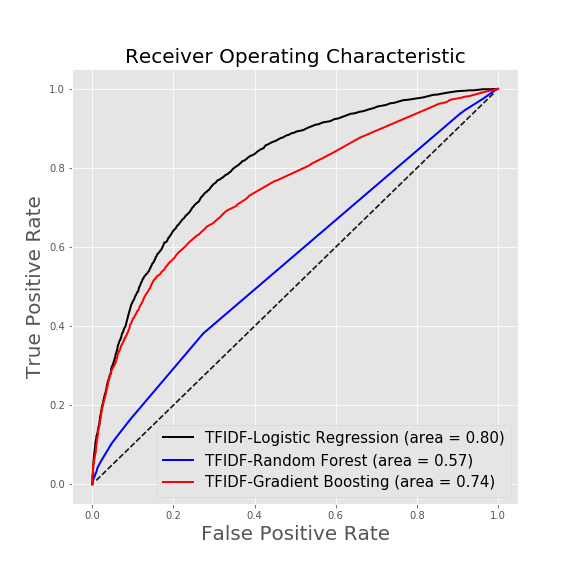

# Predicting hate speech using machine learning and natural language processing

Ben Weintraub, Ph.D.

<a href="https://www.linkedin.com/in/benweintraub-phd/">LinkedIn profile</a>

<a href="https://drive.google.com/open?id=1rgvkDE_13-l8qSbqcyUc2tsTnqDiLRcV77_3_jlWKC4"> Link to slide deck presentation</a>

## Table of Contents

- <a href="https://github.com/b-weintraub/hate-speech#background">Background</a>  
- <a href="https://github.com/b-weintraub/hate-speech#Dataset">Dataset</a> 
- <a href="https://github.com/b-weintraub/hate-speech#Exploratory-Data-Analysis">Exploratory Data Analysis</a>  
- <a href="https://github.com/b-weintraub/hate-speech#Machine-Learning-Models">Machine Learning Models</a> 
- <a href="https://github.com/b-weintraub/hate-speech#DiscussionNext-steps">Discussion/Next steps</a>

## Summary

In this study, a machine learning classifier model is developed to identify online hate speech.  Natural language processing techniques based on Term Frequency–Inverse Document Frequency (TFIDF) and Bidirectional Encoder Representations from Transformers (BERT) were implemented to encode the text.  BERT models were run using a TensorFlow GPU optimized kernel on AWS SageMaker. Machine learning classification models such as logistic regression, random forests, and gradient boosting were employed.  Model metrics are presented herein.

## Background

Hate crimes have reached alarmingly high levels in the US over the past couple years.  The U.S. Department of Justice defines a hate crime as a “criminal offense against a person or property, motivated in whole or in part by an offender’s bias against a race, religion, disability, sexual orientation, ethnicity, gender, or gender identity.”  Hate speech, as defined by the Cambridge dictionary, is "public speech that expresses hate or encourages violence towards a person or group based on something such as race, religion, sex, or sexual orientation".  In this study, we look at the relationship between online hate speech and hate crimes.  

The Pittsburgh synagogue shooting was a mass shooting that took place on October 27, 2018 killing 11 people. The gunman, Robert Bowers had earlier posted anti-Semitic comments against HIAS (formerly, Hebrew Immigrant Aid Society) on the online social network Gab.  The congregation had participated in HIAS's National Refugee Shabbat the previous week.  A couple hours before the mass shooting, Bowers posted to Gab the following, “HIAS likes to bring invaders in that kill our people.  I can’t sit by and watch my people get slaughtered. Screw your optics.  I’m going in.”  Because Bowers posted his intentions online in the form of hate speech, this brings up the question - Can online hate speech be used to predict hate crimes?

## Dataset

To explore this question, data was collected from social media site Gab.com. Started in 2016, Gab describes itself as a "free speech" alternative to Twitter and Facebook.  It attracts groups banned from other social networks and is known as a safe haven for extremists including neo-Nazis and white supremacists.

Gab data was collected from a variety of sources including the Gab pushshift api (https://gab.pushshift.io/), the Gab.ai corpus (https://files.pushshift.io/gab/), and the Gab hate corpus  (https://osf.io/edua3/).

The Gab hate corpus was generated from trained annotators reading 27,000 Gab posts. Posts were categorized as "Hate" or "not Hate" and organized into the following types and subcategories: 

| Hate subcategory/type     | Abbreviation |
| ------------- |:-------------:|
| attacks_human_dignity  | HD   | 
| call_for_violence  | CV   | 
| vulgar_offensive_language | VO    |
| religion     | REL      | 
| race/ethnicity   | RAE     | 
| sexual_orientation   | SXO      |   
| gender   | GEN      |   
| ideology   | IDL      |    
| nationality   | NAT      |    
| political_affiliation   | NAT      |    
| mental_physical_health_status   | MPH      |  

The data contained 86529 rows.  There were 11249 posts classified as 'Hate'.  Here’s a snapshot of the data:

  

## Exploratory Data Analysis
Of the subcategories of hateful speech by type, religion, race/ethnicity, and political_affiliation were most commonly found in the dataset. Additionally, attacks_human_dignity were more common than call_for_violence or vulgar_offensive_language.  Of the posts calling for violence, religion, race/ethnicity, and political_affiliation had similiar number of posts.

    <td></td>
    <td></td>
    <td></td>

## Machine Learning Models

Natural language processing techniques based on Term Frequency–Inverse Document Frequency (TFIDF) and Bidirectional Encoder Representations from Transformers (BERT) were implemented to encode the text.  

### Natural language processing models - TF-IDF
Sklearn was used to convert a collection of posts from the dataset to a matrix of TF-IDF features. Machine learning classification models including logistic regression, random forest, and gradient boosting were implemented and represent ROC curves are shown below.

    <td></td>

### Natural language processing models - BERT 

In this study, a pre-trained BERT neural network model was used with 12-layers, 768-hidden, 12-heads, and 110M parameters. A BERT-serving-server was installed on AWS SageMaker to handle the heavy processing power required. (computer: 4 vCPU processor + 16 GiB memory, kernel: Python 3 TensorFlow GPU optimized).  The following parameters were used : batch size=16, max_seq_len=50, num_worker=2.

Because of its performance with TD-IDF, logistic regression was chosen as the classifier model to use with BERT as well.  Below are comparative ROC curves looking at the difference between TD-IDF and BERT text encoding.

    <td></td>

### Model evaluation

| ML classifier     | AUC score | NLP encoder  |
| ------------- |:-------------:| -----:|
| Logistic Regression | 0.80    | TD-IDF |
| Logistic Regression | 0.74    |   BERT |
| Random Forrest      | 0.57      |    TD-IDF |
| Gradient Boosting   | 0.74      |    TD-IDF|

## Discussion/Next steps

A reasonably functioning model to classify hate speech is achieved.  ROC scores suggest that Logistic regression is best the performing machine learning classifier model.  Out of the box, BERT does not perform as well as TD-IDF, however more hyper-parameter tuning is required.  Next steps are to look at hate speech trends +/- 1 week around the time of Pittsburgh synagogue shooting to look for any correlation between hate speech and hate crime.

## References

Kennedy, B., Atari, M., Davani, A. M., Yeh, L., Omrani, A., Kim, Y., … Dehghani, M. (2018, July 18). The Gab Hate Corpus: A collection of 27k posts annotated for hate speech. https://doi.org/10.31234/osf.io/hqjxn

Fair, G., & Wesslen, R. (2019). Shouting into the Void: A Database of the Alternative Social Media Platform Gab. Proceedings of the International AAAI Conference on Web and Social Media, 13(01), 608-610. Retrieved from https://www.aaai.org/ojs/index.php/ICWSM/article/view/3258

Mostafazadeh Davani, Aida & Yeh, Leigh & Atari, Mohammad & Kennedy, Brendan & Portillo-Wightman, Gwenyth & Gonzalez, Elaine & Delong, Natalie & Bhatia, Rhea & Mirinjian, Arineh & Ren, Xiang & Dehghani, Morteza. (2019). Reporting the Unreported: Event Extraction for Analyzing the Local Representation of Hate Crimes.  https://arxiv.org/abs/1909.02126

Zannettou, Savvas & Bradlyn, Barry & De Cristofaro, Emiliano & Kwak, Haewoon & Sirivianos, Michael & Stringini, Gianluca & Blackburn, Jeremy. (2018). What is Gab: A Bastion of Free Speech or an Alt-Right Echo Chamber. 1007-1014. 10.1145/3184558.3191531.

Zannettou, S., Finkelstein, J., Bradlyn, B., et al., (2018), arXiv:1809.01644. https://arxiv.org/pdf/1809.01644.pdf
